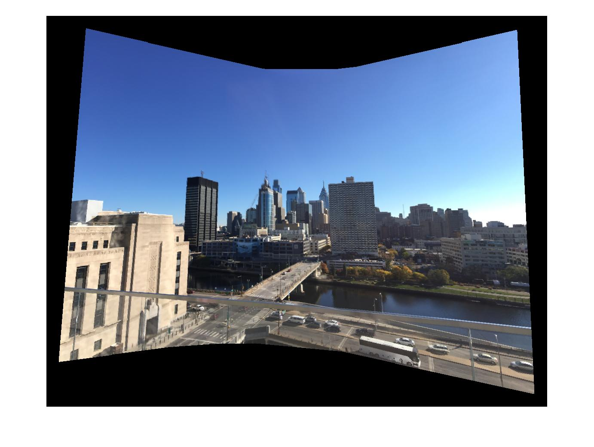
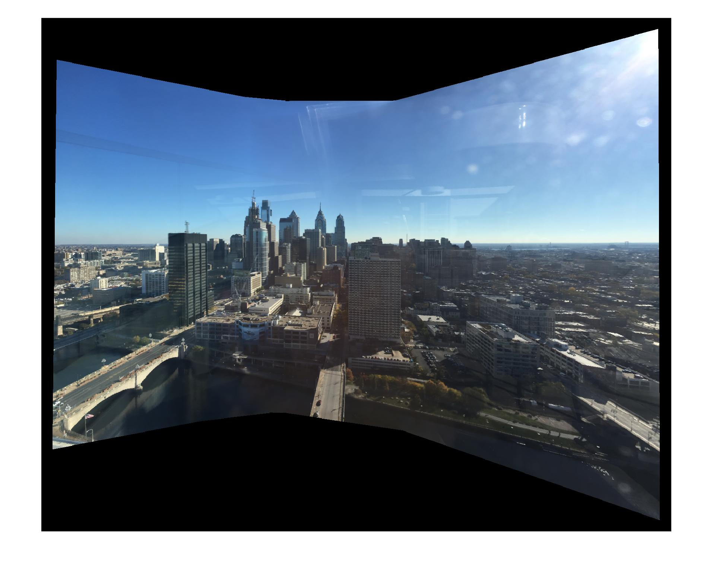
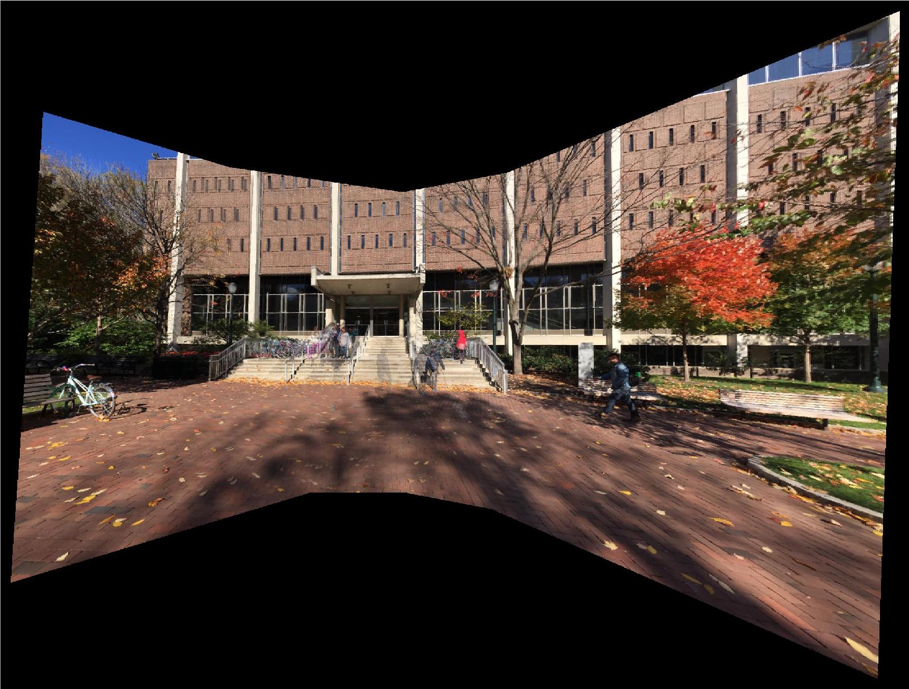
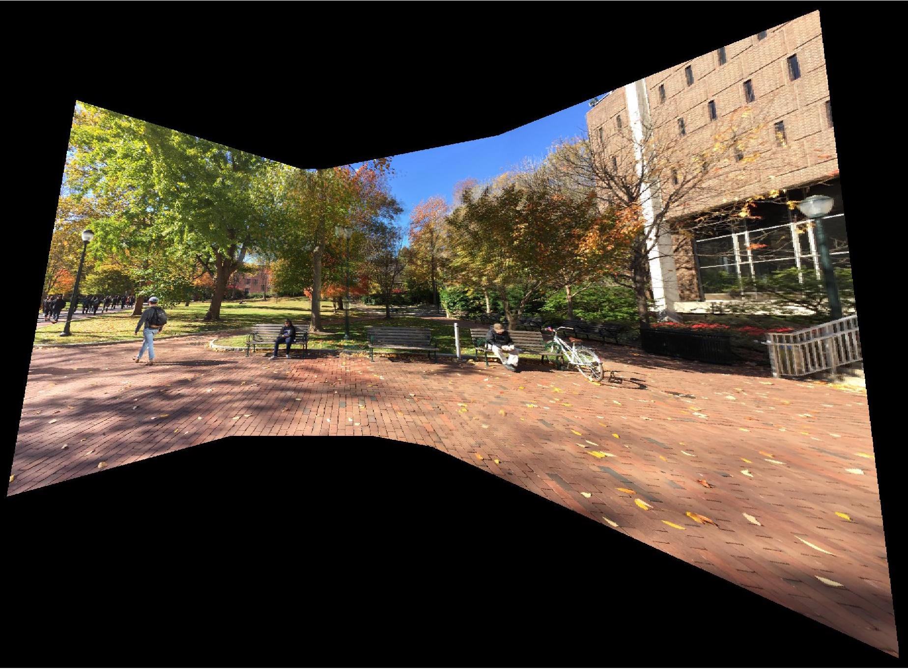

# Image Mosaic and Stitching
-Yiren Lu (luyiren [at] seas [dot] upenn [dot] edu)

A matlab implementation of image mosaic and stitching:

#### Harris corner detector
see `corner_detector_impl.m`

Harris, Chris, and Mike Stephens. "A combined corner and edge detector." Alvey vision conference. Vol. 15. 1988.

#### Adaptive Non-Maximal Suppression (ANMS)
see `anms.m`

Brown, Matthew, Richard Szeliski, and Simon Winder. "Multi-image matching using multi-scale oriented patches." 2005 IEEE Computer Society Conference on Computer Vision and Pattern Recognition (CVPR'05). Vol. 1. IEEE, 2005.

#### Geometric blur

see `geo_blur.m`

Berg, Alexander C., and Jitendra Malik. "Geometric blur for template matching." Computer Vision and Pattern Recognition, 2001. CVPR 2001. Proceedings of the 2001 IEEE Computer Society Conference on. Vol. 1. IEEE, 2001.

#### Image descriptors matching

see `feat_desc.m` or `feat_desc_geoblur.m`

- 40x40 patch descriptor downsampled to 8x8
- Normalized to mean of 0 and std of 1
- SSD of 1st matching / SSD of 2nd matching < 0.6

#### Outlier rejection by RANSAC

see `ransac_est_homography.m`

- Estimate homographic transformation matrix with 4 random feature points.

#### Image homographic warping and stitching

see `mymosaic.m`

- Pixel mapping by the homegraphic matrices

#### Image blending (distance to boundary)

see `mymosaic.m`

- Alpha = dist2border1/(dist2border1+dist2border2)

## Run Code

- See `demo.m`
- More datasets could be downloaded here: 
  <https://upenn.box.com/s/2klod8hmm139gfqwbgvj56dg3s9chppn>

## Presentation [Slides](presentation_slides.pdf)

## More Results

